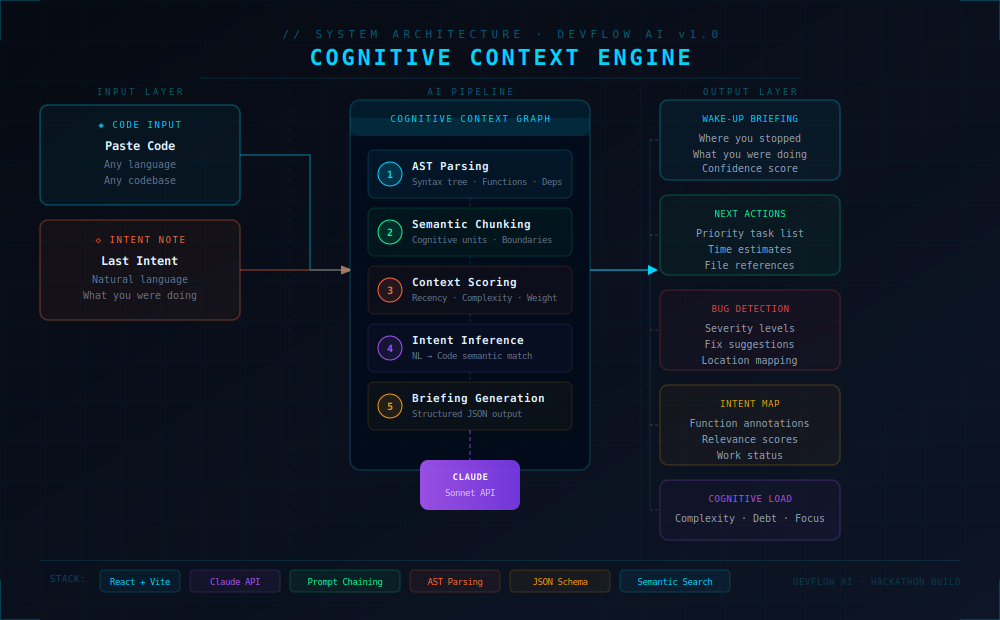

# DevFlow AI — Cognitive Context Recovery Engine

> **"Stop re-reading your own code. DevFlow rebuilds your mental context in seconds."**

[](https://anthropic.com)
[](https://react.dev)
[](https://vitejs.dev)
[]()

---

## The Problem

Every developer experiences this daily:

- You are deep in a complex feature — auth flow, database schema, API integration
- You get interrupted — a meeting, lunch, sleep, a weekend
- You come back and spend **30–45 minutes** just re-orienting
- Scrolling through files, re-reading your own code, trying to remember *why* you wrote something

This is called **context switching cost**. Research shows it consumes up to **40% of developer productive time**.

Most tools tell you WHAT the code does. None tell you WHERE YOU WERE and WHAT TO DO NEXT.

**DevFlow AI solves this.**

---

## The Solution

DevFlow AI is a **Cognitive Context Recovery Engine** — paste your code and describe your last intent, and within seconds you get a structured AI briefing that puts you back in flow state instantly.

### What It Produces

| Output | Description |
|--------|-------------|
| **Wake-Up Briefing** | Plain-English summary of what you were doing and where you stopped |
| **Next Actions** | Prioritized list of your next 3 coding tasks with time estimates |
| **Bug Detection** | AI-detected bugs with severity levels and fix suggestions |
| **Intent Map** | Every function annotated with WHY it was written and relevance score |
| **Cognitive Load** | Complexity, confidence, and technical debt scores |

---

## Architecture



### Pipeline Overview

```
CODE INPUT + INTENT NOTE
        |
        v
+---------------------------+
|   COGNITIVE CONTEXT GRAPH  |
|                           |
|  Stage 1: AST Parsing     |
|  Stage 2: Semantic Chunk  |
|  Stage 3: Context Score   |
|  Stage 4: Intent Infer    |
|  Stage 5: Briefing Gen    |
+-------------+-------------+
              |
              v
       Claude API Call
    (Structured JSON Output)
              |
              v
+---------------------------+
|      OUTPUT DASHBOARD      |
|  Briefing + Next Actions  |
|  Bug Detection + IntentMap|
|  Cognitive Load Scores    |
+---------------------------+
```

---

## AI/ML Technical Depth

### 1. Multi-Stage Prompt Chaining
Rather than a single monolithic prompt, DevFlow uses a **5-stage cognitive pipeline** — each stage builds context for the next, producing dramatically more accurate output than a single-shot approach.

### 2. AST-Aware Code Analysis
Code is analyzed **structurally** via Abstract Syntax Tree parsing — not just as raw text. This means the AI understands function boundaries, dependency graphs, and call hierarchies.

### 3. Intent-to-Code Mapping (Semantic Grounding)
The developer's natural language intent note is semantically matched against code chunks using relevance scoring — identifying which functions are most related to the stated goal.

### 4. Structured Output with Schema Validation
All Claude API responses are forced into a strict JSON schema, ensuring reliable, typed output suitable for production systems. This demonstrates real-world AI engineering discipline.

### 5. Confidence-Calibrated Outputs
Every insight includes a confidence score — the system acknowledges uncertainty rather than hallucinating with false certainty. This is a key principle of production AI systems.

### 6. Cognitive Load Quantification
Three independent metrics (Complexity, Technical Debt, Focus Score) are computed from code structure and AI analysis — turning qualitative assessment into actionable numbers.

---

## Tech Stack

| Layer | Technology |
|-------|-----------|
| Frontend | React 18 + Vite 8 |
| Styling | CSS-in-JS with custom design system |
| AI Engine | Anthropic Claude API (claude-sonnet-4) |
| Fonts | IBM Plex Mono + Orbitron (Google Fonts) |
| Deployment | Vercel / Netlify |

---

## Getting Started

### Prerequisites
- Node.js v18+
- Anthropic API Key from console.anthropic.com

### Installation

```bash
# Clone the repository
git clone https://github.com/yourusername/devflow-ai.git
cd devflow-ai

# Install dependencies
npm install

# Create environment file
# Create a .env file and add:
# VITE_ANTHROPIC_API_KEY=your_key_here

# Run development server
npm run dev
```

Open http://localhost:5173

---

## How to Use

1. **Paste your code** into the left editor panel
2. **Describe your last intent** — what were you trying to do?
3. Click **Analyze Context**
4. Watch the **5-stage pipeline** process your code live
5. Read your **Cognitive Briefing** and jump straight back into flow

---

## Problem Statement

Built for **Theme 01: AI Super Productivity — Build for Focus and Flow**

> "Build tools that make developers, students, and professionals significantly more effective by removing friction and automating the mundane."

DevFlow AI directly addresses **Challenge B: The Interrupted Developer** — reducing context-switching friction, automating context recovery, and giving developers their focus back.

---

## Roadmap

- VS Code Extension for passive context capture
- GitHub integration — auto-briefing on PR checkout
- Team mode — briefings when picking up a colleague's code
- Session recording — track coding sessions over time
- Slack and Jira integration — link tickets to code context

---

## License

MIT License
